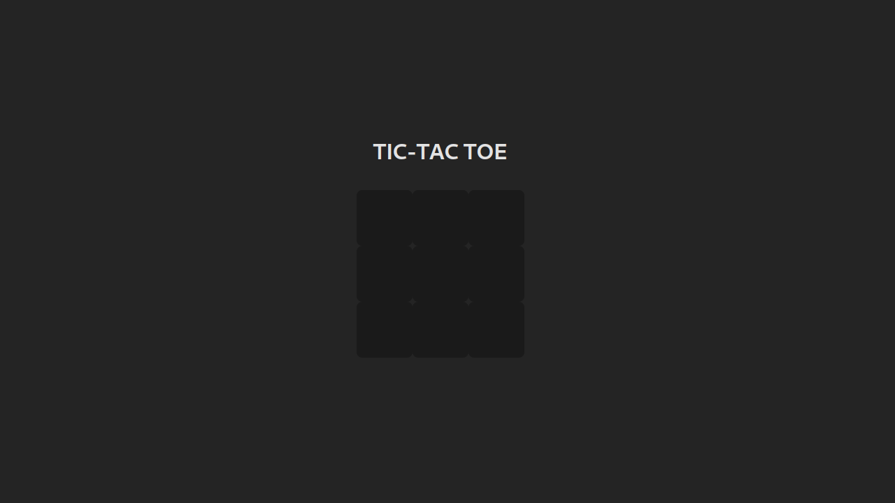

# Projeto GamePage

Este projeto é composto por três módulos principais:

1. **Jogo da Velha (Tic-Tac-Toe)**: Um jogo simples de Tic-Tac-Toe (ou Jogo da Velha) desenvolvido com React.
2. **Cadastro e Login de Usuários**: Interface para cadastro, login e remoção de usuários, utilizando leitura e escrita de arquivos locais para armazenar dados em `user.json`.
3. **Lista de Jogos Disponíveis**: Um módulo para exibir e interagir com os jogos disponíveis no sistema.



---

## Funcionalidades

### 1. Tic-Tac-Toe

- Um jogo interativo de Tic-Tac-Toe (Jogo da Velha) para dois jogadores.
- Permite que os jogadores façam jogadas alternadas, visualizem o vencedor ou empate, e reiniciem o jogo.
- O estado do jogo é gerenciado com o React, utilizando hooks (`useState`).

### 2. Cadastro e Login de Usuários

- **Cadastro de Usuários**:
   - Cadastro com nome, e-mail e senha.
   - Armazena os dados em um arquivo JSON chamado `users.json`.
- **Login de Usuários**:
   - Permite autenticar usuários com e-mail e senha previamente cadastrados.
   - Exibe mensagens de erro em caso de dados inválidos.
- **Gerenciamento de Usuários**:
   - Visualização da lista de usuários cadastrados.
   - Remoção de usuários com base no e-mail.

### 3. Lista de Jogos

- Uma interface simples para exibir os jogos disponíveis, como:
   - Jogo da Velha.
- Facilita a navegação e interação com os jogos integrados ao sistema.

---

## Tecnologias Utilizadas

- **React** para a interface de usuário.
- **CSS** para os estilos básicos.
- **Node.js** para manipulação de arquivos locais.
- **Cors** para permitir requisições de diferentes origens.
- **FS (File System)** para operações de leitura e escrita no arquivo JSON.
- **Express.js**  para gerenciamento de rotas.
---

## Como Rodar o Projeto

### Requisitos

1. **Node.js** e **npm** instalados.

### Passos para Execução

1. Clone o repositório:

   ```bash
   git clone <URL_DO_REPOSITORIO>
   cd <NOME_DIRETORIO>
   npm install
   npm start

# API do GamePage

Esta API gerencia o cadastro, login e remoção de usuários do sistema **GamePage**, utilizando leitura e escrita de dados em um arquivo local `users.json`.

---

## Como Funciona

A API utiliza **Express.js** para gerenciamento de rotas e **Node.js** para operações de leitura e escrita no arquivo local `users.json`. Todos os dados dos usuários são persistidos no arquivo `server/data/users.json`.

---

## Endpoints Disponíveis

### 1. **POST** `/login`

Realiza o login de um usuário existente.

#### Parâmetros de Entrada (JSON Body):
```json
{
  "id": "string",
  "password": "string"
}
```

#### Respostas:
- 200 OK: Login realizado com sucesso.
- 400 Bad Request: Parâmetros obrigatórios ausentes.
- 401 Unauthorized: Credenciais inválidas.

### 2. POST `/add-user`

Adiciona um novo usuário ao sistema.

```json
{
   "id": "string",
   "name": "string",
   "email": "string",
   "password": "string"
}
```

#### Respostas:
- 201 Created: Novo usuário adicionado.
- 400 Bad Request: Campos obrigatórios ausentes ou ID já existente.

### 3. DELETE `/remove-user/:id`

Remove um usuário com base no ID.

Parâmetros:
- `:id` (string): ID do usuário a ser removido.

#### Respostas:
- 200 OK: Usuário removido com sucesso.
- 400 Bad Request: ID não informado.
- 404 Not Found: Usuário não encontrado.

### 4. GET `/users`

Retorna a lista de todos os usuários registrados.

#### Respostas:
- 200 OK: Retorna um array de usuários.