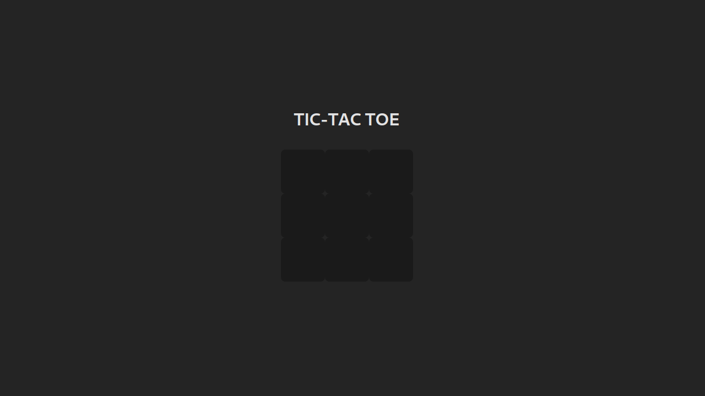

# Projeto GamePage

Este projeto é composto por dois módulos principais:

1. **Jogo da Velha (Tic-Tac-Toe)**: Um jogo simples de Tic-Tac-Toe (ou Jogo da Velha) desenvolvido com React.
2. **Cadastro e Gerenciamento de Usuários**: Uma interface para cadastro, login e remoção de usuários, integrada com um backend que utiliza uma API RESTful.



## Funcionalidades

### Tic-Tac-Toe

- Um jogo interativo de Tic-Tac-Toe (Jogo da Velha) para dois jogadores.
- Permite que os jogadores façam jogadas alternadas, visualizem o vencedor ou empate, e reiniciem o jogo.
- O estado do jogo é gerenciado com o React, utilizando hooks (`useState`).

### Cadastro de Usuários

- Cadastro de usuários com nome, e-mail e senha.
- Visualização de usuários cadastrados.
- Remoção de usuários.
- A funcionalidade de cadastro, deleção e listagem de usuários é integrada a uma API RESTful utilizando fetch para comunicação com o backend.

## Tecnologias Utilizadas

- **React** para a interface de usuário.
- **React Router** para navegação entre as páginas.
- **CSS** para os estilos básicos.

## Como Rodar o Projeto

### Requisitos

1. **Node.js** e **npm** instalados.
2. Backend com uma API disponível no endereço `http://localhost:8080` (necessário para o cadastro e gerenciamento de usuários).

### Passos para Execução

1. Clone o repositório:

   ```bash
   git clone <URL_DO_REPOSITORIO>
   cd <NOME_DIRETORIO>
   npm install
   npm start
   ```

## Backend (API)

### Endpoints da API:

- **GET `/users`**: Retorna a lista de usuários registrados.
- **POST `/add-user`**: Cadastra um novo usuário.
- **DELETE `/remove-user/:id`**: Remove um usuário pelo ID.
